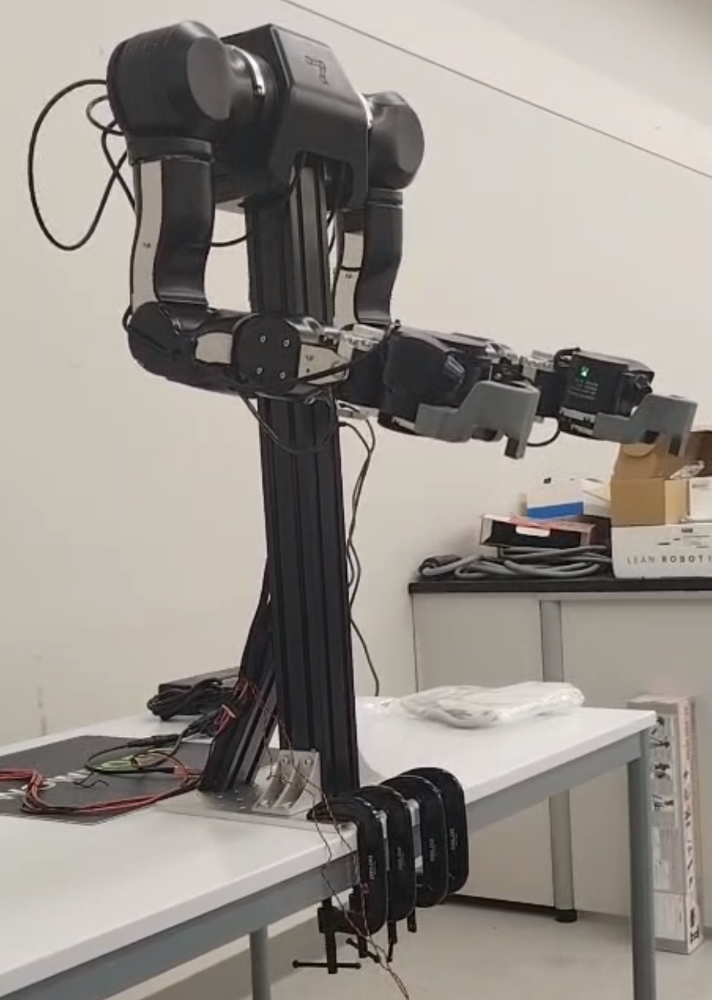
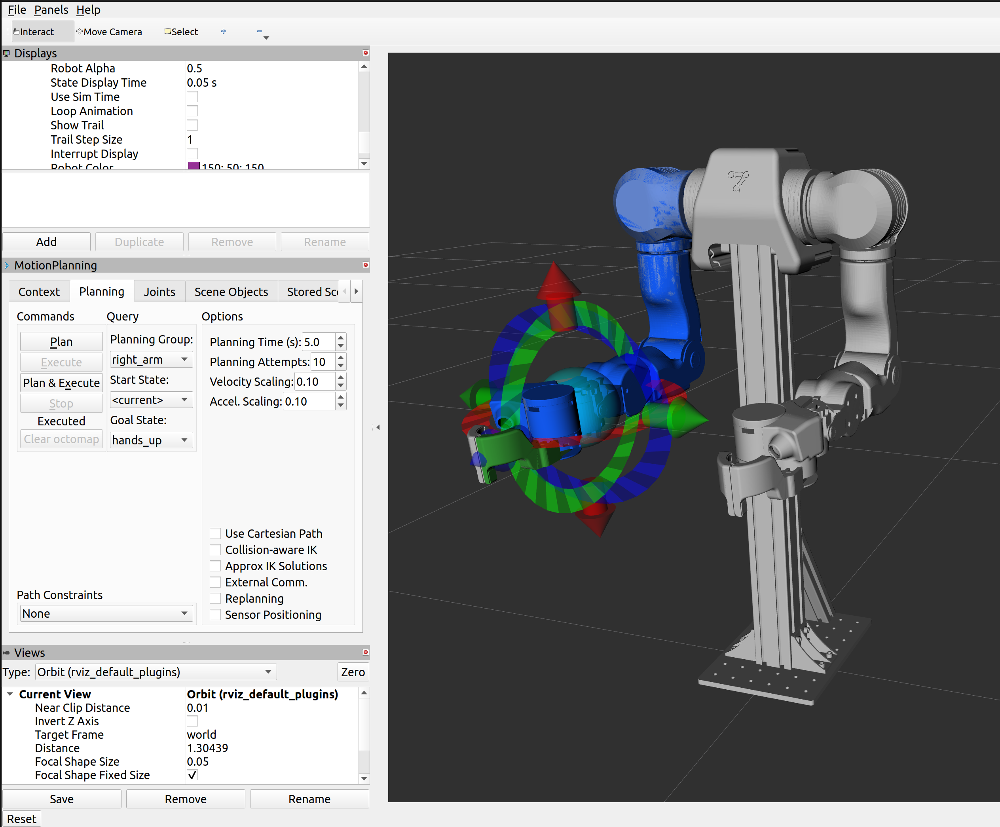

# OpenArm 2.0 ROS2 Workspace

My ROS2 Humble workspace for bringing up and controlling a bimanual [OpenArm 2.0](https://openarm.dev/) setup (two arms, CAN-FD / Damiao motors) with MoveIt2.

Includes a fix for a MoveIt2 gripper controller config bug that caused gripper execution to fail on real hardware (see [Fixes](#fixes-made) below).

## Demo

### Real hardware


### RViz / MoveIt2 simulation


## Hardware setup

- 2x OpenArm 2.0 (7 DOF + gripper each), Damiao motors, CAN-FD
- PCAN-USB Pro FD adapters, `can0` (right arm) / `can1` (left arm)
- 24V PSU per arm
- Host: Ubuntu 22.04, ROS2 Humble

## Repo structure

- `src/openarm_ros2/` — [enactic/openarm_ros2](https://github.com/enactic/openarm_ros2), with a local fix to `openarm_bimanual_moveit_config`
- `src/openarm_description/` — [enactic/openarm_description](https://github.com/enactic/openarm_description) (URDF/meshes)

`openarm_can` (the low-level CAN driver + Python bindings) is **not** vendored here — it's installed system-wide via the official OpenArm PPA (see below).

## Setup from scratch

```bash
# System-wide CAN driver + CLI tools (PPA)
sudo add-apt-repository -y ppa:openarm/main
sudo apt update
sudo apt install -y openarm-can-utils libopenarm-can-dev

# ROS2 dependencies
sudo apt install -y \
  ros-humble-controller-manager \
  ros-humble-gripper-controllers \
  ros-humble-hardware-interface \
  ros-humble-joint-state-broadcaster \
  ros-humble-joint-trajectory-controller \
  ros-humble-forward-command-controller \
  ros-humble-moveit-configs-utils \
  ros-humble-moveit-planners \
  ros-humble-moveit-ros-move-group \
  ros-humble-moveit-ros-visualization \
  ros-humble-moveit-simple-controller-manager

# Build
git clone https://github.com/Samar150602/openarm-setup ~/openarm_ws
cd ~/openarm_ws
colcon build --packages-ignore openarm_can
source install/setup.bash
```

## Bringing up the CAN interfaces

```bash
sudo ip link set can0 type can bitrate 1000000 dbitrate 5000000 fd on
sudo ip link set can0 up

sudo ip link set can1 type can bitrate 1000000 dbitrate 5000000 fd on
sudo ip link set can1 up
```

Scan for motors on either bus:

```bash
sudo openarm-can-cli -i can0 discover
```

## Running

**Simulation (fake hardware):**

```bash
source ~/openarm_ws/install/setup.bash
ros2 launch openarm_bimanual_moveit_config demo.launch.py
```

**Real hardware:**

```bash
source ~/openarm_ws/install/setup.bash
ros2 launch openarm_bimanual_moveit_config demo.launch.py use_fake_hardware:=false
```

Opens RViz with MoveIt2's MotionPlanning panel. Drag the interactive markers on either arm's end effector, Plan, review, then Execute.

⚠️ **Loop Animation**: uncheck "Loop Animation" under Displays → MotionPlanning → Planned Path before running on real hardware — it's on by default and will re-execute the last trajectory repeatedly otherwise.

## Fixes made

### Gripper controller action type mismatch

**Symptom:** arm trajectories executed fine, but gripper motions failed with:
```
Action client not connected to action server: right_gripper_controller/gripper_cmd
Failed to send trajectory part 1 of 1 to controller right_gripper_controller
```

**Cause:** `moveit_controllers.yaml` declared the gripper controllers as `type: GripperCommand` / `action_ns: gripper_cmd`, but the actually-spawned controllers (`ros2_controllers.yaml`) are `joint_trajectory_controller/JointTrajectoryController`, which serve `FollowJointTrajectory` on `follow_joint_trajectory` — not `GripperCommand`.

**Fix:** in `openarm_bimanual_moveit_config/config/openarm_v2.0/moveit_controllers.yaml`, changed both `left_gripper_controller` and `right_gripper_controller` entries from:
```yaml
type: GripperCommand
action_ns: gripper_cmd
```
to:
```yaml
type: FollowJointTrajectory
action_ns: follow_joint_trajectory
```

## License

`openarm_ros2` and `openarm_description` are Apache 2.0, © Enactic, Inc. See their respective `LICENSE` files.